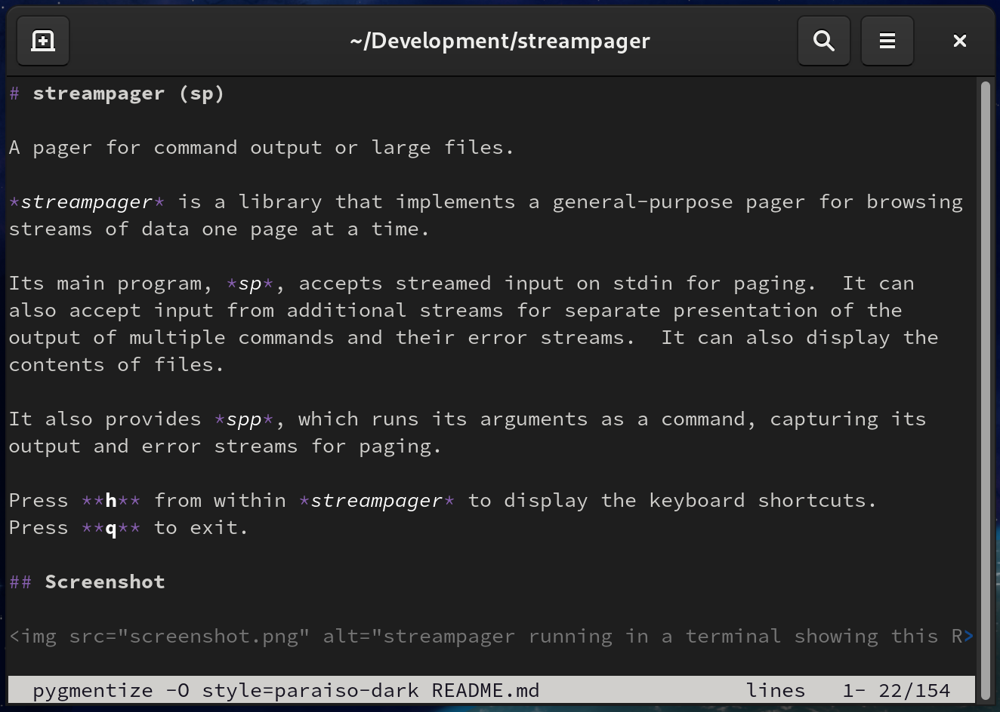

# streampager (sp)

[](https://docs.rs/streampager)


A pager for command output or large files.

*streampager* is a library that implements a general-purpose pager for browsing
streams of data one page at a time.

Its main program, *sp*, accepts streamed input on stdin for paging.  It can
also accept input from additional streams for separate presentation of the
output of multiple commands and their error streams.  It can also display the
contents of files.

It also provides *spp*, which runs its arguments as a command, capturing its
output and error streams for paging.

Press **h** from within *streampager* to display the keyboard shortcuts.
Press **q** to exit.

## Screenshot



## Basic Usage for *sp*

If invoked with no arguments, *sp* reads from stdin, expecting to be invoked as
the final command in a pipeline:

    my_command | sp

By default, *streampager* will immediately enter fullscreen mode and page
the input.

This can be customized:

This behaviour can be customized:

* The `-X` option prevents fullscreen mode.  Instead, output will be displayed
  directly to the terminal until either a full screen of input is received, or
  **`Space`** is pressed.
* The `-D <SEC>` option causes *streampager* to wait for a number of seconds
  to see if the input stream terminates early with less than a full screen of
  output.  If it does, streampager displays this directly to the terminal and
  exits.  If the input stream produces more than a full screen of data, the
  delay expires, or **`Space`** is pressed, *streampager* enters full screen
  mode.
* The `-F` option re-enables immediate fullscreen mode if a different mode has
  been selected in the *streampager* configuration file.

An indicator at the bottom right of the screen shows if the input stream
is still connected, and whether new data is being loaded.

*sp* can also be used to display files by providing their file names as command
line arguments.

## Additional Streams

*sp* can page multiple input streams from different file descriptors
on separate screens.  These additional streams can be passed in using the
`--fd` option.

## Error Streams and Progress Indicators

Input streams that are the error output for a stream can also be provided using
the `--error-fd` option.  As well as being shown on their own screen, the last
8 lines of an error stream are also shown at the bottom of the screen belonging
to the corresponding main stream.

An additional stream for progress indicators can be provided with the
`--progress-fd` option.  This input stream expects to receive progress updates
(e.g. progress bars) terminated by ASCII form-feed characters (`\f` or `\x0C`).
*sp* will display the most recently received progress indicator at the bottom
of the screen.

Progress indicator pages should not contain control codes that are used for
moving the cursor or clearing parts of the display.  Control codes that affect
the color or style of output are accepted and passed through to the terminal.

Calling processes that are using *sp* to page their own output can also provide
the file descriptor for these streams by setting the `PAGER_ERROR_FD` and
`PAGER_PROGRESS_FD` environment variables.

## Invoking Commands

The `-c` option causes *sp* to invoke the specified command, and capture its
standard output and standard error streams as separate streams.

For example:

    sp -c "grep -r foo /path"

will run *grep*, and page its output.  Errors from *grep* will be paged
separately from the main output.

The `-c` option can be specified multiple times to run multiple commands
and page all of their outputs as separate streams.

The *spp* program runs the rest of its command line arguments as a single
command.  For example:

    spp grep -r foo /path

is equivalent to the previous example.

## Configuration

*streampager* can be configured by a configuration file at
`$CONFIG_DIR/streampager/streampager.toml`.  The configuration directory
varies by platform; on Linux it is typically `~/.config`.

### Example Configuration

```
interface_mode = "delayed"
scroll_past_eof = true
read_ahead_lines = 20000
startup_poll_input = true
wrapping_mode = "word"
keymap = "mykeymap"
```

## Keyboard Shortcuts

*streampager* provides various shortcuts for common operations, many of which
are compatible with `less`.  See the help screen for a full list.  The most
common ones are listed below.

The keymap can be overridden by setting `keymap` in the *streampager*
configuration file.  Keymap files should be located in
`$CONFIG_DIR/streampager/keymaps/`.

### General

* **`q`**: Quit.
* **`h`** or **`F1`** Show the help screen.
* **`Esc`**: Close help or any open prompt.

### Navigation

* **Cursor Keys**: Move one line or four columns.
* **`Shift` + Cursor Keys**: Move one quarter of the screen.
* **`Page Down`** or **`Space`**: Move a full page down.
* **`Page Up`** or **`Backspace`**: Move a full page up.
* **`Home`** and **`End`**: Move to the top or bottom of the file.
* **`:`**: Go to a line number or percentage through the file.
* **`[`** and **`]`**: Switch to the previous or next file.

### Presentation

* **`#`**: Toggle display of line numbers.
* **`\`**: Toggle line and word wrapping.

## Things Left To Do

* [ ] Line ending detection and handling (display `<CR>` in files with mixed line
  endings).
* [ ] Support composing character sequences (e.g. "لآ")
* [ ] Saving content to a file on disk (Key: **`s`**)
